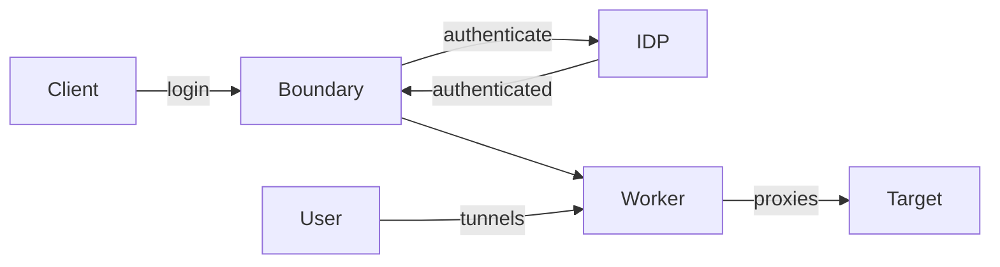

# Day 2

## Break
1:25 am → 10 min

## Defeat the "Computer Setup Blues" and Get Coding Faster with Backpack
1:35 am → 30 min, Jurnell Cockhren; Nomad 

DevEx impact learning.
DevEx accelerate social impact.
Civichacker.com
Anti-Oppressive tech.

Why code schools?
Improve their livings, gain knowledge to fulfill their passion, to fill demand.
The problem: employers claim gradates are not prepared.
Localized market situation.
...

There are a lot of pain point with BYOD (bring you own device).

...
Not sure what is point is atm.

The website does not tell a lot. 
Not sure what he wants to sell here.

## Credential Injection with Boundary and Vault
2:05 am → 30 min, Kalam Abdul; Boundary Terraform Vault 

Goal: provide granular access to target systems without vpn or bastions hosts.
Boundary works as an identity aware proxy.
Bastions and VPNs havae the problem that you only have access or not.

HCP Boundary as the manged variant.
Control plane manages state and the worker function as proxies.

Dynamic catalog with aws and azure.
It uses tags to build hosts set.
Boundary supports AWS CLoudwatch and Datadog for auditing.

He did not really talk about the injection.

## Terraform and DevSecOps: Top 10 Lessons Learned for Scaling Terraform
2:35 am → 30 min, Aakash Shah; Terraform 

CTO at oak9.

oak9 - Security as Code.

Growing complexity increases the risk of flaw, also due to rapid changes.
45% breaches happen in the cloud.
Architectures a codified in terraform an they are not static any more.
This makes security harder.

Building modern security practices that scale.

1. Culture and Operation Model.
Most common challenges is culture.
Knowledge silos.
Top down culture is most effective here, driving having champions.

1. Shifting Left.
100x higher cost of fixing issues post deployment.
Significant lower costs identifying issues earlier in the development life cycle.

1. Focus on Design.
Static misconfiguration checking does not scale.
Build security design pattern.
Reusable pattern provide a reference for securing a common set of technology use-case and misuse-cases.
Over 50% reduction in cost.

1. Building Practices for Continuous Evolution.
Embrace automation.
Continuous improve processes, because new business, technology or security requirement.
Think automation first.

1. Embrace Automation
Automation is the only way to scale.
Very resource constraint.

1. Fit into Development Workflow

1. Modules and Templatization.
Centralized vs distributed, partnership with architecture and development teams, create value for common pattern, commonly-used cloud resources.

1. Security as Code.
Best (mostly only) way to secure a cloud application or system.
(selling talk for oak9 at this point)

1. Secret Management.
Use secret management solutions like Vault.
Define guard rails in security-as-code.

1 Establish Relevant Metrics.
Velocity of Delivery. Velocity of Resolution, Security Cost Avoidance & Reduction, Security Quality of Delivery, Collaboration.

Demo show how oak9 is integrated into GH and runs check on the IOC code.
The dashboard show issues and how to solve them.
Also shows the risks.

## IRSA Evolved: Transparent AWS Access by Any Kubernetes Workload
3:05 am → 30 min, David Alexander; Vault 

IRSA?
IAM Roles for Service Accounts.
Ties a kube service account to an AWS IAM role.

Use cases.
external-dns w/Route53.
CSI driver for aws elastic block store (ebs).
Application stores blobs in s3 buckets.
Or integration from the app to any aws api.

K8s add an annotation to the IAM role.
And an IAM trust policy.
Federated OIDC for web identity.

The assume role is assume role with web identity.

Limits: same account only.
Hard to scale trust policies everywhere.
Kube cluster -> OIDC provider -> IAM role.

Vault is an identity translator.
Bring your own identity.
Produces native identity.
Purposed build for not only AWS.

Vault Agent Injector.
Pod + annotations -> Pod + Vault Agent.
If annotations match it will inject a vault injector as a side car.
Once could inject `~/.aws/credentials` `~/.aws/config` in INI syntax.
Environment variables like `AWS_PROFILE`, `AWS_SHARED_CREDENTIALS_FILE`.
You could point it to a vault injected file.

Inject these credentials with vault.
Multiple profiles could be provided.
Vault will keep out dating credentials up to date.

github.com/thelonelyghost

## Providing Waypoint as a Service Across Multi-Cluster Kubernetes
3:35 am → 30 min, Abigail Bangser; Waypoint 

Skipped.

## Getting Started with Minikube in Vagrant
4:05 am → 30 min, Bervianto Leo Pratama; Vagrant 

Skipped.

## Hybrid Microservices with HashiCorp Stack
4:35 am → 30 min, Thang Chung, Phuong Le; Consul Nomad Terraform Vault 

Skipped.

## Behavior Driven Development Helps Shift Security Left
5:05 am → 30 min, Josh Armitage; Terraform 

Key takeaways:
1. BDD is about communication
1. Modules should be deep not wide

Book by him: Cloud Native Security Cookbook.

Compliance meets Automated testes => Runable Specification.
Ideally written in structure natural English that many people can understand it.
Sentinel to do BDD test of tf-resources.
But hard to read for product.
Rather use a more readable approach.
Gurken have issue of losing clarity if there are too many `and` assertions.
Muss be written with Product Owner & Engineers.

Prevent: prevent it from getting worse.
Detect: 
Remediate:
All together is compliance as code.

Check Terraform Compliance + Cucumber.

Module Design.
In the context of an enterprise, so private modules.
Modules done well can enable `Secure By Default`.
e.g. Enforce lest privilege for KMS keys.
How to archive product market fit for modules?
Who are your users?
Developers as lightning, they will take the path of least resistance.
Modules are abstraction.
What's a good abstraction?
A good abstraction reduces cognitive load.
Deep abstraction vs wide abstraction.
Wide means you need to know much to use the abstraction.
Wideness will cause resistance.
E.g. Variables. 
Less is better.
Permutations of variables make it hard.
Heuristics for modules quality.
Modules for Today, not Tomorrow.
Do not over abstract.

How else to reduce resistance?
Solid documentation.
Hash corp them self have great documentation.
Invest in teams. 
Build the module with teams.
Commit fully, building it means, maintaining it.

Books: Team Topologies

Collaborate build, go to facilitate mode and then to the as a service mode.
Will only work if trust is build.

Books: 
* Software Engineering at Google 
* A philosophy of software design

## Break
5:35 am → 10 min

## Validate IAM Policy Using Terraform Run Tasks
5:45 am → 30 min, Welly Siauw; Terraform 

Missed the start as I was on my way to the train.

There is a lambda function is used to check the validity of the IAM policy.
AWS IAM Access Analyzer is utilized.
Outcome of the check is called back to the pending terraform cloud task.
github/wellsiau-aws

## Everything You Need to Know About *CDK - The Internals: From CDKTF to CDK8s
6:15 am → 30 min, Liav Yona; Terraform 

Sadly nothing new here. 

## Packer and Terraform to Build a Nomad Cluster in vSphere
6:45 am → 30 min, Sam Gabrail; Nomad Packer Terraform 

Workflow
* Run Packer locally, will create a template in vSphere
* Upon push run terrafrom in gitlab
* TF will create vms
* gitlab will run ansiblea (using ngrok)
* ansible will install nomad in the vms

He demos a zero downtime update ob consul and nomad.

## Securing Vault Agent in an Existing Windows Environment
7:15 am → 30 min, Alain Chiasson; Vault 

Does not seem to be too interesting.

PKI chain using active directory certificate service.
CSR and Proof of Possession.

Interesting approach but very boring presentation.
Vault agent is the magic component here.

## Consul Dataplane on Kubernetes
7:45 am → 30 min, Norbert Gruszka; Consul 

Love story of service_andrew & service_barbara.
They are deployed in a private network communication is easy.
Andrew move into another network. 
The other network has the same address space and there are firewall, connection is hard to establish.

How to help barbara to connect to andrew?
Can we use a NAT?
Wait what?
Consul is a service mesh solution.
Automated service discovery and automated networking.
mTLS and Zero trust solution.
Allows to connect resources deployed in different clusters.

Consul Agent, a long running daemon on each node of the cluster.
Each agent is a client or a server.
Can run as a DNS or HTTP interface.

2 Private networks and NAT gateway.
Subnet as a K8s.
Consul data plane deployment.
Side car for each pod, the data plane.
The NAT is not required.
... how the peering works here is not clear to me.
github.com/hashicorp/consul-k8s

## How to Deploy Your HashiCorp Stack with Ansible in Under 15 Minutes
8:15 am → 30 min, Chris van Meer; Consul Nomad Vault 

As we run K8s this was not too interesting for me.

## Building an Agnostic Security Solution with HashiCorp Vault
8:45 am → 30 min, Hillol Habib Un Nabi; Terraform Vault 

How to manage secrets agnostic.
Agnostics means in this context that it's not specific to a special cloud provider.
Becomes more relevant in case of multi-cloud setups.

Did not follow anymore at some point.
Need to re-watch.

## When You're in Command of the Incident
9:15 am → 30 min, Martin Smith; Culture Other 

What is incident command (ICS)?
Fire system in the 70s.
To unify incident management and have a clear chain of command.
Roles
* Incident Commander
* Public Information Officer
* Liaison Officer 
* Safety Officer
* Operations, Planning, Administration, Logistics

DR scenario should be exercised to perform well in case of an incident.

What happens in general?
* What's in a plan
* What are we doing?
* Who is responsible for doing it?
* How are we going to communicate?
* How do we handle thins that happen?

OODA: observe -> orient -> decide -> act -> observe -> ...

The commander is not participating on the resolution.
In full control, hold folks accountable, in charge of the full company.
But it's also a grueling job.
Anger people in position of power.
Risk of hurting colleagues.
It's exhausting.

How to improve the situation.
First Responder: you are in charge until you can hand it off.
Commander or Ivestigator?
Depending on your abilities.
If you are better in solving issues, or better organizing.
Repletion ships in the org are helpful.
Shadowing incident commanders.
If you are a good commander make sure to share you xp.

Practice, talk someone through something, specific, direct language.
Learn your stack.
Broad knowledge is helpful, find the right teams/people at the right time. 
`Keep talking and no one explodes` is a good practice for teams.
Feedback, is also very important, encourage feedback.
Make sure you are coachable.

Have game days.

Common challenges.
No one response to a page?
Why?
To many pages, burned out?
Have a well groomed escalation path.
Stop declaring incidents.
If something happens constantly it's might not be an incident.

If someone in power suggest the commander to do something.
Be polite, have seniors help that have a good relation to that person.
Ensure that you are the commander and are in charge.
Ask the person to leave.

Too many threads.
Swimlanes with objectives and deadlines.
Separate chats/meeting room.
Request async chatter.
Add assistant commanders.

More automation, less manual processes.

There are incident management frameworks lime NIST.

## Break
9:45 am → 10 min

## Terraform for Platform Teams
9:55 am → 30 min, Issac Goldstand; Terraform 

Worked at a large company, and they invested heavily into devops.
IaC is the basis, for platform engineers.
Developers base on the platform team.
Is DevOps dead, now that platform team is on the rise.
A lot of time was spend teaching developers to become devops.
In some cases it does not work that each team own their environment.
E.G. Networking might not be managed like this.

Lets create a rest api for developers to perform infrastructure changes.
Hides the actual complexity and allows permission checks.

There are a ton of community maintained providers.

... rewatch

## Exploring and Provisioning Infrastructure with Packer
10:25 am → 30 min, Andrei Buzoianu, Elif Samedin; Packer 

What is packer?
Build images for VMs or Containers.

What does packer solve?
Immutable Infrastructure.
Configuration drift.

TTM (time to market) & S2M (speed to market)

Really bad presentation.

https://github.com/docker/docker-bench-security

## Back to the Future: Service Mesh for Legacy Software
10:55 am → 30 min, Lev Andelman; Consul 

Why not use service mesh all the time?
More CPU more memory required.
Higher latency.

Legacy servers will be mashed with consul server.

checkout `demo-magic`

The concept of intentions in consul are like firewall rules.
Consule and envoy proxy is used to archive this.
Traffic it now encrypted (mTLS).

Consul has some build in circuit breaker.

Service Mesh is grate for HTTP services.
Even with TCP it's create.
You gain encryption and access control.

Service Mesh can be used without k8s.

## Containerized Infrastructure-as-Code with Immutable Clusters
11:25 am → 30 min, Felipe Angelo Sgarbi; Consul Nomad Terraform Waypoint 

## Using HCP Waypoint
11:55 am → 30 min, Marko Bevc; Waypoint 

## HCP Boundary at Home
12:25 pm → 30 min, Pato Arvizu; Boundary 

## Closing remarks
12:55 pm → 5 min
