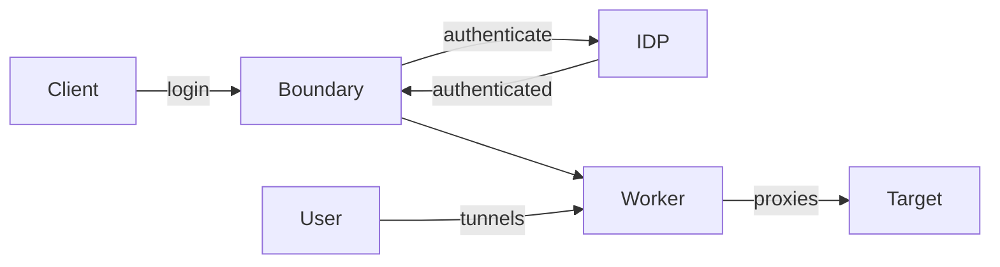
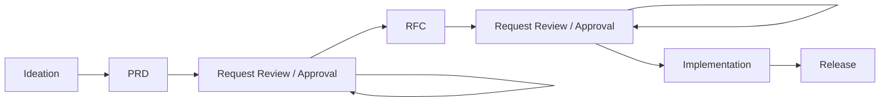

# Summary

##### HashiCorp Packer

> Create identical machine images for multiple platforms from a single source configuration.


There is an [Terraform provider for docker by kreutzwerker](https://github.com/kreuzwerker/terraform-provider-docker).
([Docs](https://registry.terraform.io/providers/kreuzwerker/docker/latest/docs))

> The Docker provider is used to interact with Docker containers and images. It uses the Docker API to manage the lifecycle of Docker containers. Because the Docker provider uses the Docker API, it is immediately compatible not only with single server Docker but Swarm and any additional Docker-compatible API hosts.

It could be used to replace docker compose.

##### HashiCorp Boundary

> Boundary is a secure remote access solution that provides an easy way to allow access to applications and critical systems with fine-grained authorizations based on trusted identities across clouds, local data centers, low-trust networks.

Would give an audited and IDP authenticated replacement for our Bastion.
Enables a zero trust network.
Uses a KMS (Key Management System), e.g. HashiCorp Vault to manage secrets.
In the manage version it will inject secrets into the services to allow for short-lived secrets or OTP.
Worker nodes handle the tunneling to targets.
The control plane also provides an administration ui.
There also is a GUI client app to make access even easier.



##### HashiCorp Nomad

> A simple and flexible scheduler and orchestrator to deploy and manage containers and non-containerized applications across on-prem and clouds at scale.

Practically a K8s alternative that can run on e.g. EC2, but also on Azure compute, etc.

##### HashiCorp Waypoint

> Waypoint allows developers to deploy, manage, and observe their applications through a consistent abstraction of underlying infrastructure. Waypoint works with Kubernetes, ECS and many other platforms.

An abstraction over e.g. Helm, configured using HCL (like every product by HC).
Could be something for preview apps as it allows developers to `waypoint up` deploy to a cluster. 
`waypoint destroy` to clean up again.
(How to handle credentials here?, Vault possibly).

##### [AWS Transient Gateway](https://aws.amazon.com/de/transit-gateway/)

Can be used to connect VPC if you have name.
Peering is always only point to point as such it will sooner or later be Cartesian product of NxM.
The gateway work like a router between VPCs.

##### AWS Terraform Modules

There are 46 (at point of writing) [AWS maintained Terraform Modules](https://registry.terraform.io/namespaces/terraform-aws-modules).
These modules have best practices build and are highly recommended.

##### Platform Teams

Platform Teams provide building block with security and best practices to the developers.
This building block a meant to enable developers and provide a nice DX (developer experience).
Building Blocks can be e.g. terraform module or githunb workflow template.
These blocks must be easy to use, must be standardized and compliant.
Automation is very important -> IssueOps.

##### Terraform Module development

Enterprise modules should be deep not wide.
Breath is determined by the amount a variable declared.
So modules should do a lot without exposing to much variables.

Generic resources can be managed by git submodules.

Use `for_each` over `count`.
The `for_each` has an if clause that can be used.
 
```hcl
user_resource_groups_map_filtered = {
    for item in local.user_resource_groups_list :
        format("%s-%s", item[0]["name"], item[1]["suffix"]) => {
        # ...
        } if item[1]["bastion"] == true
}

```

Set of resources created with `count` are index by integers.
Set of resources created by `for_each` will index with any key you want, way more deterministic.

[Examples](https://github.com/movinalot/hashitalks-2023)


##### [Cilium](https://cilium.io/)

> eBPF-based Networking, Observability, Security 

Is a CNI plugin that implements eBPF to filter packages on `L3`,`L4` and `L7`.
eBPF allows to hook into every packages that that it computed by the kernel.
It's used with K8s, but with `netreap` it can be used with Nomad as well.


##### HashiCorp Consule

> Consul provides a single control plane to enable a broad ecosystem for service networking

Service Registry & Service Mesh.
Can be used to virtually group VPC to a WAN (WAN Federation with Consul).
Uses envoy proxy to connect cross cloud traffic.


##### 1Password CLI

You can use 1Password as a Secret Manager for the server.
It allows for templating in e.g. `.env` files.
Replace secrets with references of the secret and in memory replace them by `op-run --env-files tf apply`.


##### HashiCorp Vault

KMS.
Is way saver to use for secret management in GithubAction.
(Same would be possibly with AWS SecreteManager).
You can use the OIDC token to manage fine grained access to secrets.
The token handed by github has a lot of information about the scope.

Vault can be used as the CA provider for Consul.
Consul stores it's CA on disk which is very unsafe.
Vault will never store anything unencrypted to a persistent storage.


##### EKS Blueprints

There are [EKS Blueprints](https://aws-ia.github.io/terraform-aws-eks-blueprints/v4.24.0/) maintained by AWS.
It has a bunch of extension for EKS like Graphana/Prometheus etc.
Has a concept of Teams (Plarform Team, Application Team).
Each team get it's own name space and users.

Works well with Waypoint.

##### OPA - [Open Policy Agent](https://www.openpolicyagent.org/)

Is an OSS policy engine.
Together with [Styra](https://www.styra.com/) it can be used to check permissions while applying terraform resources.
e.g. Can one a security group open access to a specific port.

##### Writing Culture at HashiCorp

works.hashicopr.com

They use 2 documents for product development 
* Problem Requirements Document PRD: Defining the problem
* Request for Comment RFC: Proposing solutions.



The open sourced [hermes](https://github.com/hashicorp-forge/hermes).

The templates:
* https://docs.google.com/document/d/1Oz_7FhaWxdFUDEzKCC5Cy58t57C4znmC_Qr80BORy1U/edit
* https://docs.google.com/document/d/1oS4q6IPDr3aMSTTk9UDdOnEcFwVWW9kT8ePCNqcg1P4/edit


##### oak9

Security as Code.
Had 10 lessons learned for scaling terraform.

1. Culture and Operation Model.
Most common challenges is culture.
Knowledge silos.
Top down culture is most effective here, driving having champions.

1. Shifting Left.
100x higher cost of fixing issues post deployment.
Significant lower costs identifying issues earlier in the development life cycle.

1. Focus on Design.
Static misconfiguration checking does not scale.
Build security design pattern.
Reusable pattern provide a reference for securing a common set of technology use-case and misuse-cases.
Over 50% reduction in cost.

1. Building Practices for Continuous Evolution.
Embrace automation.
Continuous improve processes, because new business, technology or security requirement.
Think automation first.

1. Embrace Automation
Automation is the only way to scale.
Very resource constraint.

1. Fit into Development Workflow

1. Modules and Templatization.
Centralized vs distributed, partnership with architecture and development teams, create value for common pattern, commonly-used cloud resources.

1. Security as Code.
Best (mostly only) way to secure a cloud application or system.
(selling talk for oak9 at this point)

1. Secret Management.
Use secret management solutions like Vault.
Define guard rails in security-as-code.

1 Establish Relevant Metrics.
Velocity of Delivery. Velocity of Resolution, Security Cost Avoidance & Reduction, Security Quality of Delivery, Collaboration.


##### IRSA - IAM Roles for Service Accounts.

We use the OIDC provider of the EKS cluster for this.
This limits to regions.
He proposed an approach where he used vault secret injector to generate `.aws/config` and `.aws/secrets`.
This allows dynamic switching by profile during runtime to scope access per service method.
Templating is done Pod annotations.

github.com/thelonelyghost


##### Incident Commander

Special Role for Incidents that take full responsibility during the incident but also has all permissions.

What is incident command (ICS)?
Fire system in the 70s.
To unify incident management and have a clear chain of command.
Roles
* Incident Commander
* Public Information Officer
* Liaison Officer 
* Safety Officer
* Operations, Planning, Administration, Logistics
